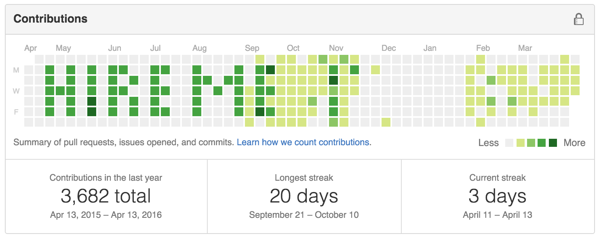

# github-contributions-matrix-committer

## About
Ever want to write a message on your GitHub Contributions matrix? Figure out the dates you'd need blocks covered in order to spell something, and then use this program to fill it in!


## Configure
Adjust dates_to_draw.txt with the dates you'd like to cover with random commits
The date must be in this format: `mmddHHMMyy`
for example 0311124315 for March 11th, 2015 at 12:43pm

Make sure the dates_to_draw.txt file has a blank newline at the end, or else the last line may be skipped.

## Run
Make sure that dates_to_draw.txt is present alongside github_commit_block_message.sh
```bash
bash github_commit_block_message.sh
```

This has been tested on Mac OSX, and no other system.
